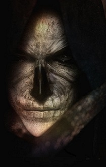

<html>

<b>Azengaard Encounters</b>

<b>Tactical quest mod for EET</b>

A mod originally written by Josh Clue. 
The mod adds some encounters to confront the player with the Bhaal heritage.  

 - in the circus tent there is an extra level to take you back to the Sarevok showdown
 - The Tethir pass has some surprise for you
 - an optional component enhances Trademeet crypt

  
  

 
&nbsp;

&nbsp;

</body>

</html>

